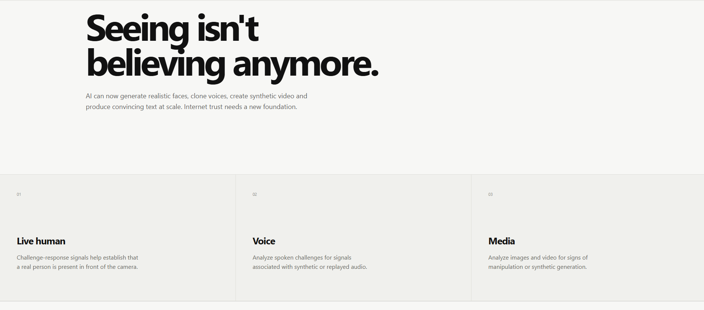
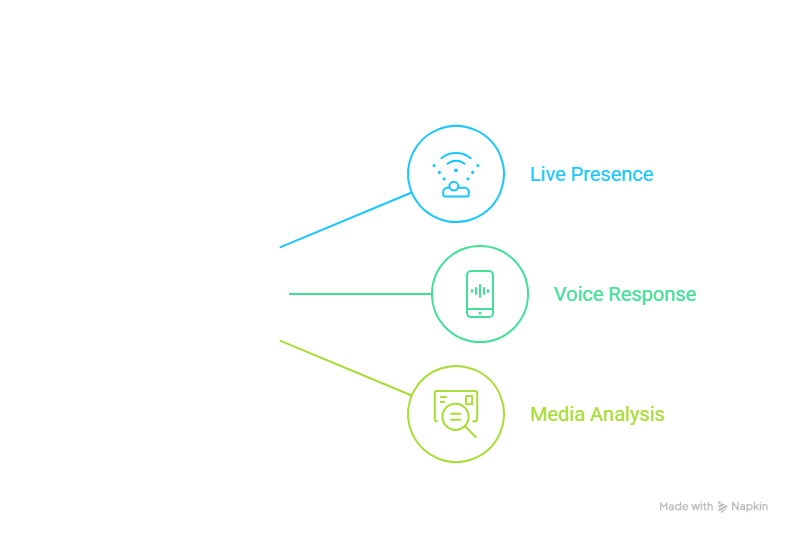
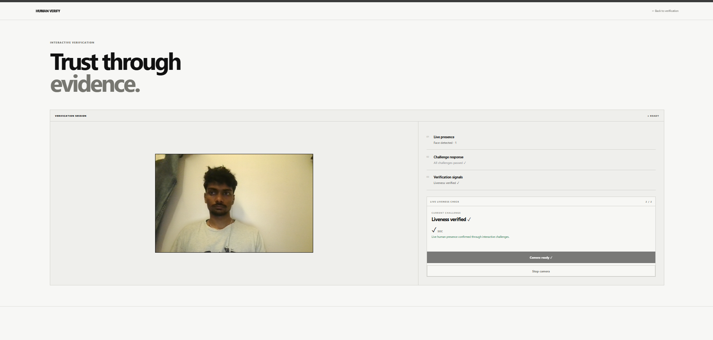
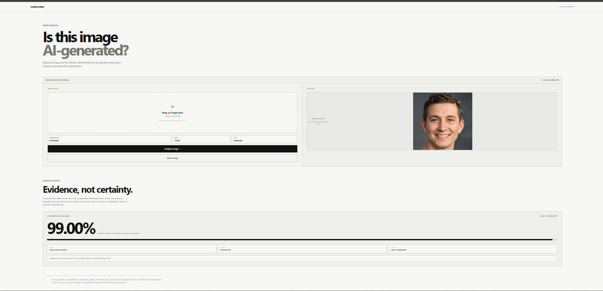

## Why Human Verify?

AI has changed what can be trusted online.

Faces can be generated.  
Voices can be cloned.  
Images can be synthesized.  
Text can be produced at scale.

Traditional "I'm not a robot" verification was not designed for this environment.

Human Verify explores a different approach: instead of relying on a single universal authenticity score, applications can use independent verification signals to obtain additional evidence.

<p align="center">
  
</p>

---

## One Verification Layer. Multiple Signals.

| Verification Layer | Purpose | Status |
|---|---|---|
| Live Presence | Interactive camera-based challenge response | Working |
| Voice Response | Randomized spoken challenge | Working |
| Audio Analysis | Basic acoustic signal analysis | Working |
| Media Analysis | AI-generation likelihood for images | Working |
| Text Analysis | Machine-generated text indicators | Roadmap |
| Video Analysis | Synthetic/manipulated video analysis | Roadmap |

The modules are intentionally independent so that individual detection methods can evolve without requiring the entire verification system to be rebuilt.

---

## Architecture

Human Verify separates verification into independent signal-processing modules.

<p align="center">
  
</p>

> Human Verify evaluates signals associated with human presence and digital content. It does not establish a person's identity.

The architecture is designed around the principle:

```
Detection
    ↓
Analysis
    ↓
Evidence
    ↓
Decision
```
The goal is not to manufacture certainty.
The goal is to provide useful evidence that applications can interpret according to their own risk requirements.
Verification Modules
01 — Live Presence
Challenge-response verification through the camera.
The Live Presence module uses randomized facial challenges to evaluate whether a user is actively interacting with the camera.
<p align="center">
  
</p>

Current capabilities
- Camera-based face detection
- Facial landmark analysis
- Randomized challenges
- Head movement detection
- Blink detection
- Real-time verification state
- Challenge timeout handling
- Interactive challenge-response flow
Verification flow
```
Camera
   ↓
Face detected
   ↓
Random challenge
   ↓
User performs movement
   ↓
Facial landmarks analyzed
   ↓
Challenge completed
   ↓
Presence evidence
```
The current implementation demonstrates randomized live-presence challenges using browser camera access and MediaPipe Tasks Vision.
02 — Voice Response
Read the phrase. Prove your response.
The Voice Response module generates a randomized phrase that the user must speak aloud.
<p align="center">
  
</p>

Current capabilities
- Randomized phrase generation
- Timed challenge-response
- Browser speech recognition
- Phrase matching
- Microphone capture
- Audio recording
- RMS energy measurement
- Peak amplitude analysis
- Zero-crossing analysis
- Frequency analysis
- Basic pitch estimation
- Recorded audio playback
- Log-mel visualization prototype
Verification flow
```text
Random phrase
      ↓
User speaks
      ↓
Microphone capture
      ↓
Speech recognition
      ↓
Phrase matching
      ↓
Audio signal analysis
      ↓
Verification evidence
```

The current voice implementation is an MVP.
It is not presented as a dedicated synthetic-voice or deepfake detector.
Advanced synthetic-voice detection is part of the future roadmap.
03 — Media Analysis
Is this image AI-generated?
The Media Analysis module allows users to upload an image and obtain an AI-generation likelihood from an external detection service.
<p align="center">
  
</p>

Processing pipeline
Image Upload
      ↓
Human Verify Backend
      ↓
Sightengine GenAI Detection
      ↓
AI-generation likelihood
      ↓
Evidence shown to user

The current prototype uses a Flask backend to communicate with the detection service without exposing API credentials to the browser.
Evidence, not certainty
The detector output is treated as an evidence signal.
An AI-generation likelihood is not proof of:
- Image origin
- Authenticity
- Truth
- Intent
- Fraud
Detection performance can also vary depending on image compression, editing, screenshots, post-processing, newer generation models and detector limitations.
Verification Philosophy
Human Verify is intentionally designed around a simple principle:
Trust should come from evidence, not from an unsupported universal score.

Different verification signals answer different questions.
Signal	What it can indicate
Live Presence	Whether a person is interacting with the camera
Voice Response	Whether a user completed a randomized spoken challenge
Audio Analysis	Characteristics of the captured audio signal
Media Analysis	Whether an image is likely AI-generated
Text Analysis	Future indicators associated with machine-generated text


A verification result does not automatically establish:
- Identity
- Truth
- Intent
- Legitimacy
- Absence of fraud
AI-generated content is not automatically fraudulent.
Human-created content is not automatically truthful.
Human presence is not the same as identity.
Technology Stack
Frontend
- Vite
- Vanilla JavaScript
- HTML5
- CSS3
- MediaPipe Tasks Vision
- Web Camera APIs
- Web Audio APIs
- Browser Speech Recognition APIs
Backend
- Python
- Flask
- Flask-CORS
- Requests
- python-dotenv
Detection / Analysis
Live Presence
MediaPipe Tasks Vision for facial landmark and blendshape analysis.
Voice
Browser Speech Recognition and Web Audio APIs for the current MVP.
Media
Sightengine GenAI Detection API for AI-generation likelihood analysis.
Current Prototype
The current prototype demonstrates an end-to-end modular verification workflow.
```
                    HUMAN VERIFY
                         │
          ┌──────────────┼──────────────┐
          │              │              │
          ▼              ▼              ▼
    Live Presence   Voice Response   Media Analysis
          │              │              │
          ▼              ▼              ▼
     Face Signals    Audio Signals   Media Signals
          │              │              │
          └──────────────┼──────────────┘
                         ▼
                   Evidence Layer
```
Current status
Component	Status
Landing Page	Working
Verification Hub	Working
Live Presence	Working
Randomized Facial Challenges	Working
Blink Detection	Working
Head Movement Detection	Working
Voice Challenge	Working
Speech Matching	Working
Audio Capture	Working
Audio Signal Analysis	Working
Log-Mel Visualization	Prototype
Media Upload	Working
Sightengine Integration	Working
Image AI-Generation Analysis	Working
Text Analysis	Roadmap
Advanced Synthetic Voice Detection	Roadmap
Video Analysis	Roadmap
Production API	Roadmap
Large-scale Validation	Not yet completed


Repository Structure
The intended project architecture is modular:
```
human-verify/
│
├── backend/
│   ├── app.py
│   ├── requirements.txt
│   └── .env.example
│
├── public/
│
├── src/
│   ├── features/
│   │   ├── liveness/
│   │   ├── media/
│   │   ├── text/
│   │   ├── verify/
│   │   └── voice/
│   │
│   ├── main.js
│   └── style.css
│
├── docs/
│   └── images/
│
├── index.html
├── verify.html
├── liveness-test.html
├── audio-test.html
├── media-test.html
├── text-test.html
├── voice-test.html
├── voice-audio-test.html
├── voice-analysis-test.html
├── voice-mel-test.html
│
├── package.json
├── package-lock.json
├── vite.config.js
├── .gitignore
├── LICENSE
└── README.md
```
Running the Project
Frontend
Install the frontend dependencies:
npm install

Start the development server:
npm run dev

The Vite development server normally runs at:
http://localhost:5173

Backend
Move into the backend directory:
cd backend

Create a Python virtual environment:
python -m venv venv

On Windows PowerShell:
.\venv\Scripts\Activate.ps1

Install dependencies:
pip install -r requirements.txt

Sightengine Configuration
Create:
backend/.env

Add:
SIGHTENGINE_API_USER=your_sightengine_api_user
SIGHTENGINE_API_SECRET=your_sightengine_api_secret

Never publish the real .env file.
Use:
backend/.env.example

as the public configuration template.
Start the backend:
python app.py

The backend normally runs at:
http://127.0.0.1:5000

Health check:
http://127.0.0.1:5000/api/health

API
Image Analysis
POST /api/analyze-image

The request uses multipart form data:
image=<uploaded image>
```
The backend:
Receive image
     ↓
Validate file
     ↓
Validate size
     ↓
Send to Sightengine
     ↓
Request GenAI analysis
     ↓
Extract likelihood
     ↓
Return structured response
```
Example response:
{
  "ai_likelihood": 0.99,
  "predicted_label": "AI-generated",
  "model": "sightengine-genai",
  "note": "Sightengine AI-generation score only; not proof of image origin or truth."
}

The numerical value represents the detector's returned likelihood for AI generation.
It should not be interpreted as detector accuracy.
Security
API credentials are intentionally kept on the backend.
The following should never be committed:
backend/.env
backend/venv/
node_modules/
dist/

Never place API credentials directly inside:
app.py
main.js
README.md
.env.example

The .env.example file should contain only placeholder values.
Privacy
Human Verify follows a privacy-conscious architecture.
Browser permissions are requested only when the relevant verification workflow requires access to the camera or microphone.
For Media Analysis, uploaded images are sent to the configured third-party detection service for analysis.
A production implementation will require explicit policies covering:
- User consent
- Data retention
- Data deletion
- Security
- Third-party processing
- Regional privacy requirements
- Logging
- Access control
This prototype does not claim automatic compliance with any particular privacy regulation.
Roadmap
Phase 1 — Working Prototype
- Live presence verification
- Randomized facial challenges
- Voice response verification
- Basic audio analysis
- Image AI-generation detection
- Modular verification hub
- Flask backend
- API-ready architecture
Phase 2 — Real-World Validation
- Pilot users
- Real verification sessions
- False-positive evaluation
- False-negative evaluation
- Latency measurement
- Reliability testing
- Security testing
- Browser compatibility testing
Phase 3 — Advanced Verification
- Stronger liveness detection
- Dedicated synthetic-voice detection
- Expanded image detection
- Video analysis
- Text-generation analysis
- Multi-signal verification workflows
- Workflow-specific risk thresholds
Phase 4 — Developer Platform
- Production API
- SDKs
- Developer documentation
- Authentication
- Usage monitoring
- Enterprise deployment
- Custom verification workflows
- Third-party detector integrations
Limitations
Human Verify is currently an experimental prototype and has not undergone large-scale production validation.
Important limitations include:
- Liveness performance has not been evaluated across a large population.
- Voice analysis is currently an MVP and does not constitute dedicated synthetic-voice detection.
- Browser speech recognition behavior can vary between browsers.
- Media detection can produce false positives and false negatives.
- AI-generation detectors can become less effective against newer generation techniques.
- The system does not establish a person's identity.
- The system does not determine whether content is truthful.
- AI-generated content is not automatically fraudulent.
- Human-created content is not automatically authentic or truthful.
Potential Applications
Human Verify can potentially support verification workflows across areas such as:
- Digital onboarding
- Financial services
- Remote interviews
- Online examinations
- Marketplaces
- Social platforms
- Customer support
- Remote collaboration
- Content platforms
- Developer applications
These are potential application areas, not claims of current deployment.
Design Principles
01 — Evidence over certainty
Verification systems should expose useful evidence rather than manufacture certainty.
02 — Human presence is not identity
Detecting a live person does not automatically establish who that person is.
03 — Authenticity is not truth
A human-created image does not automatically prove that the image is truthful.
04 — AI-generated does not mean fraudulent
Synthetic media can have legitimate uses.
05 — Modular architecture
Each verification capability should be independently replaceable and extensible.
06 — Privacy-conscious design
Only the data required for a particular verification workflow should be requested.
Development Philosophy
```
Human Verify separates:
Detection
    ↓
Analysis
    ↓
Evidence
    ↓
Decision
```

This allows individual detection systems to evolve without requiring the entire verification platform to be rebuilt.
The system is intended to provide a foundation for experimentation, evaluation and future developer-facing verification infrastructure.
Vision
Verification should become infrastructure.
The internet needs verification systems designed for an environment where digital content can be generated, transformed and manipulated at scale.
Human Verify is being developed toward a developer-first verification layer where applications can request the signals appropriate to their risk level.
```
Low Risk
    ↓
Basic Human Presence


Medium Risk
    ↓
Human Presence + Voice


High Risk
    ↓
Human Presence + Media
+ Additional Signals
```
The long-term goal is not to replace every identity or fraud system.
It is to provide an additional verification layer that developers can integrate into applications where digital trust matters.
Verify presence. Analyze signals. Build trust through evidence.

Contributing
Contributions, technical feedback and research collaboration are welcome.
Potential contribution areas include:
- Liveness detection
- Synthetic voice detection
- Media forensics
- AI-generated text analysis
- Privacy engineering
- Security
- Backend architecture
- Frontend development
- Evaluation methodology
- Detector benchmarking
Before submitting significant changes, open an issue describing the proposed approach.
License
This project is licensed under the MIT License.
See the LICENSE file for details.
Third-party services, models, libraries and APIs remain subject to their respective licenses and terms.
Disclaimer
Human Verify is an experimental research and product prototype.
Verification results are estimates or evidence signals generated by software and third-party detection systems.
They should not be interpreted as absolute proof of:
- Human identity
- Human authenticity
- Content authenticity
- Truthfulness
- Intent
- Legitimacy
- Absence of fraud
Production deployments require appropriate security, privacy, legal, compliance and performance validation.
Human Verify
Verify presence.
Analyze signals.
Build trust through evidence.

One correction from the earlier version: I used your actual current image names from the screenshot, so you do not need to rename anything.

The seven README references are:

```text
docs/images/hero.png
docs/images/problem.png
docs/images/architecture.png
